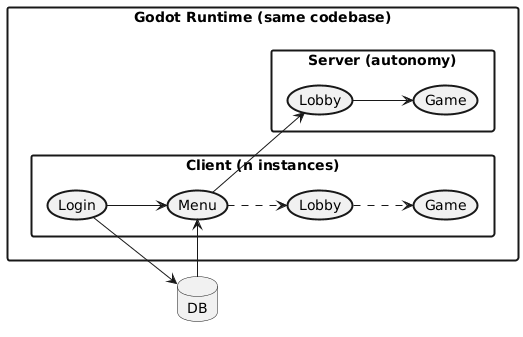

# Game Title
Fast-paced 2–8 player 2D PvP arena with fully destructible environment.  
Built in Godot with C#.

## Tech
- Godot Engine v4.6.1.stable.mono.official.14d19694e (Mono)
- .NET 10
- C#
- Netcoding -> WebRTC



<details>
<summary>PlantUML source</summary>

```
@startuml
left to right direction
skinparam monochrome true
skinparam shadowing false
skinparam linetype ortho
skinparam usecaseBorderThickness 2
skinparam rectangleBorderThickness 2

database "MySQL" as DB

rectangle "HTTP Service" as HTTP {
  usecase "Matchmaker" as Matchmaker
  usecase "Login" as LoginS
}

rectangle "Godot Runtime (same codebase)" {

  rectangle "Client (n instances)" {
	usecase "Login" as LoginC
	usecase "Menu" as Menu
	usecase "Lobby" as LobbyC
	usecase "Game" as GameC

	LoginC <-> LoginS
	LoginC ..> Menu
	Menu ..> LobbyC
	LobbyC ..> GameC
  }

  rectangle "Server (autonomy)" {
	usecase "Lobby" as LobbyS
	usecase "Game" as GameS

	LobbyS --> GameS
  }
}

' HTTP flows
Menu --> Matchmaker
LoginS <--> DB

' Match assignment
Matchmaker --> LobbyS : Docker execute

' Netcoding (WebRTC)
LobbyC <.> LobbyS : WebRTC
GameC <.> GameS : WebRTC

@enduml
```
</details>

## Core Gameplay
- 2–8 players
- 2D PvP arena combat
- Fully destructible tilebased map
- Round-based matches
- Skill-based movement & aiming

## Multiplayer
- Server-authoritative model  
- Clients send: input / actions  
- Server syncs: state / destruction / hits  
- Dedicated server supported
- Crossplay on most platforms
	- Android
	- HTML5
	- Windows
	- Linux
	- Others come later:
		- iOS
		- MacOS
		- Xbox
		- Playstation

## Requirements
- Godot 4.6 Mono
- .NET 10 SDK

## Run (Editor)
1. Install .NET 10  
2. Open project in Godot 4.6 Mono  
3. Run project  

# Database
- MySQL

## Bash commands (bash) -
### Executions
sudo systemctl start mysql 
sudo systemctl stop mysql
sudo systemctl restart mysql
sudo systemctl status mysql

### Auto-start boot
sudo systemctl enable mysql
sudo systemctl disable mysql

### Other info
OS → systemd → mysql service → DB server
mysql -u gameuser -p

## Export
Godot → Export → choose platform

## Status
Prototype / early development

## License
All rights reserved. No use, distribution, or modification permitted without permission from the authors.
