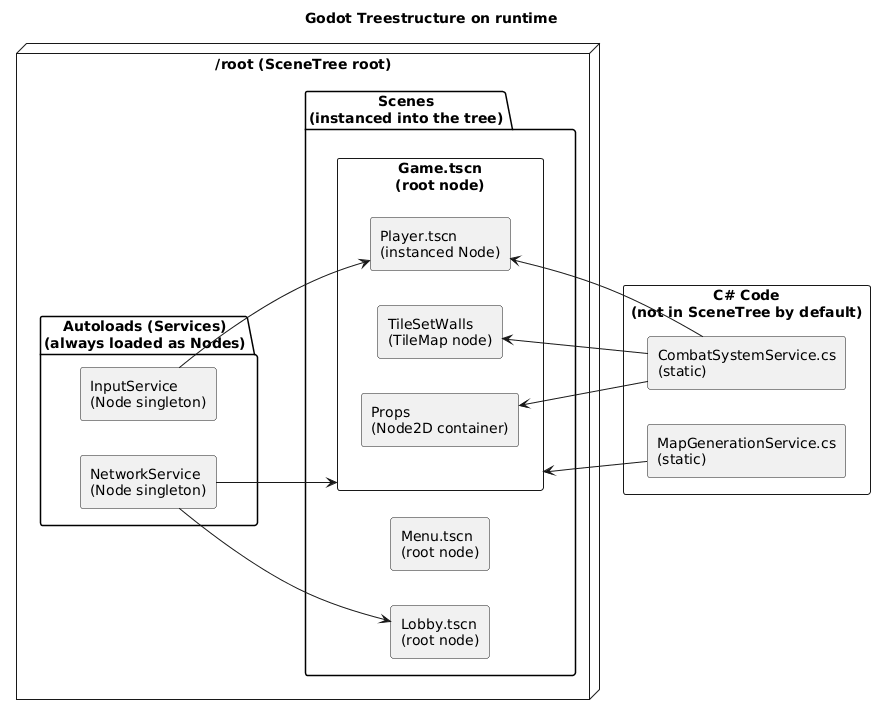
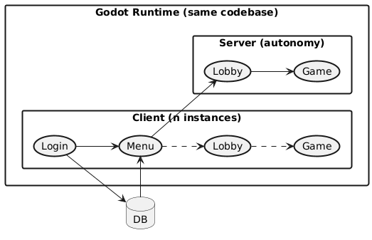
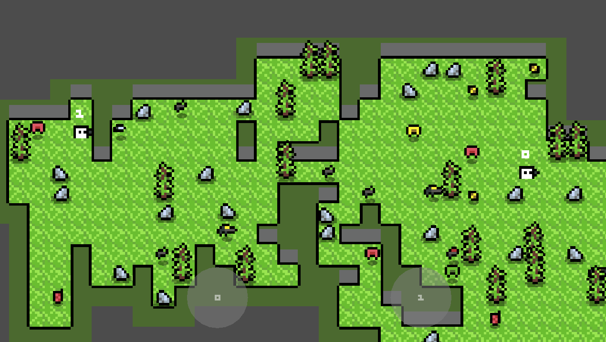
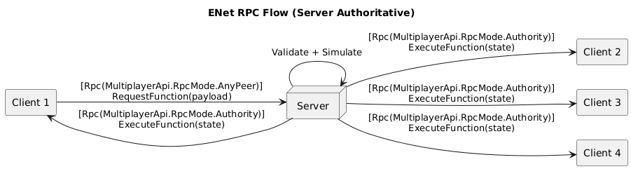

# Arena Destruction (working title)

Fast-paced **2–8 player 2D PvP arena combat** with a **fully destructible environment**.  
Built using **Godot + C#** with a **server-authoritative multiplayer model**.

---

# Overview

Players fight in destructible arenas where terrain, props, and structures can be destroyed dynamically during combat.  
Matches are **round-based** and emphasize **skillful movement, positioning, and aiming**.

Key ideas:

* Small competitive arenas
* Fully destructible tile-based maps
* Server-authoritative networking
* Cross-platform multiplayer
* Modular architecture using services

---

# Technology

### Engine

* **Godot Engine v4.6.1 (Mono)**
* Requires the **.NET version of Godot**

### Language

* **C#**
* **.NET 10**

### Networking

* **ENet**
* Server-authoritative simulation

### Backend

* **MySQL**
* External HTTP services (login / matchmaking)

---

# Architecture

The game is structured around **low coupling and high cohesion** by splitting systems into independent services.

Examples:

* InputService
* NetworkService
* CombatSystemService
* MapGenerationService

Core gameplay objects then depend on these services instead of directly depending on each other.

---

## Godot Runtime Structure

<p align="center">
  
  <br>
  <em>Runtime scene tree structure showing autoload services, scenes, and gameplay objects.</em>
</p>

<details>
<summary>PlantUML source</summary>

```
@startuml
title Godot Treestructure on runtime
left to right direction
skinparam shadowing false
skinparam componentStyle rectangle

node "/root (SceneTree root)" as ROOT {

  folder "Autoloads (Services)\n(always loaded as Nodes)" as AUTO {
    component "InputService\n(Node singleton)" as INP
    component "NetworkService\n(Node singleton)" as NET
  }

  folder "Scenes\n(instanced into the tree)" as SCENES {
    component "Menu.tscn\n(root node)" as MENU
    component "Lobby.tscn\n(root node)" as LOBBY
    component "Game.tscn\n(root node)" as GAME {
      component "Player.tscn\n(instanced Node)" as PLAYER
      component "TileSetWalls\n(TileMap node)" as WALLS
      component "Props\n(Node2D container)" as PROPS
    }
  }
}

rectangle "C# Code\n(not in SceneTree by default)" as CODE {
  component "CombatSystemService.cs\n(static)" as COMBAT
  component "MapGenerationService.cs\n(static)" as MAPGEN
}

PLAYER <-- INP
PLAYER <-- COMBAT
WALLS <-- COMBAT
PROPS <-- COMBAT
GAME <-- MAPGEN
NET --> GAME
NET --> LOBBY
@enduml
```

</details>

---

## Backend / Runtime Architecture

<p align="center">
  
  <br>
  <em>High-level system architecture including clients, server runtime, HTTP services, and database.</em>
</p>

<details>
<summary>PlantUML source</summary>

```
@startuml
left to right direction
skinparam monochrome true
skinparam shadowing false
skinparam linetype ortho

database "MySQL" as DB

rectangle "HTTP Service" as HTTP {
  usecase "Matchmaker" as Matchmaker
  usecase "Login" as LoginS
}

rectangle "Godot Runtime (same codebase)" {

  rectangle "Client (n instances)" {
	usecase "Login" as LoginC
	usecase "Menu" as Menu
	usecase "Lobby" as LobbyC
	usecase "Game" as GameC

	LoginC <-> LoginS
	LoginC ..> Menu
	Menu ..> LobbyC
	LobbyC ..> GameC
  }

  rectangle "Server (autonomy)" {
	usecase "Lobby" as LobbyS
	usecase "Game" as GameS

	LobbyS --> GameS
  }
}

Menu --> Matchmaker
LoginS <--> DB
Matchmaker --> LobbyS : Docker execute

LobbyC <.> LobbyS : WebRTC
GameC <.> GameS : WebRTC
@enduml
```

</details>

---

# Gameplay

Core gameplay characteristics:

* **2–8 players**
* **2D PvP arena combat**
* **Fully destructible tile-based environments**
* **Round-based matches**
* **Skill-based movement and aiming**

## Example Arena Layout

<p align="center">
  
  <br>
  <em>Example illustration of a destructible arena layout concept.</em>
</p>

---

# Multiplayer

The game uses a **server-authoritative model**.

Clients only send:

* Input
* Ability usage
* Requests

The server performs:

* Validation
* Simulation
* Hit detection
* Destruction
* State synchronization

## Network Communication Model

<p align="center">
  
  <br>
  <em>ENet communication model where clients send requests and the server broadcasts authoritative results.</em>
</p>

<details>
<summary>PlantUML source</summary>

```
@startuml
title ENet RPC Flow (Server Authoritative)
left to right direction
skinparam shadowing false

rectangle "Client 1" as C1
rectangle "Client 2" as C2
rectangle "Client 3" as C3
rectangle "Client 4" as C4

node "Server" as S

C1 --> S : RequestFunction(payload)
S --> S : Validate + Simulate

S --> C1 : ExecuteFunction(state)
S --> C2 : ExecuteFunction(state)
S --> C3 : ExecuteFunction(state)
S --> C4 : ExecuteFunction(state)

@enduml
```

</details>

---

# Platform Support

Target platforms:

* Windows
* Linux
* Android
* HTML5

Planned later:

* iOS
* MacOS
* Xbox
* Playstation

---

# Setup

### Requirements

Install:

* **Godot Mono (.NET version)**
* **.NET 10 SDK**

Then:

```
git clone <repo>
open project in Godot
```

Run normally in editor.

---

# Run Arguments

The project supports command-line arguments to control runtime behavior.

### Available arguments

| Argument | Description |
|--------|-------------|
| `--server` | Starts the game in **server mode** |
| `--port <int>` | Sets the **network port** used by the server |
| `--headless` | Runs Godot **without rendering or graphics** (recommended for dedicated servers) |

---

## Example: Run Dedicated Server

### Using exported game build

```
game.exe --server --port 7777
```

---

### Using Godot CLI (when already inside the project directory)

```
godot --headless --server --port 7777
```

---

### Using Godot CLI with explicit project path

```
godot --headless --path . --server --port 7777
```

---

## Behavior

* If `--server` is present → game runs as a **server**
* If `--server` is absent → game runs as a **client**
* `--port` overrides the default server port
* `--headless` disables rendering for efficient dedicated servers

Arguments are parsed at runtime using:

```
OS.GetCmdlineArgs()
```

---

# Documentation

Additional documentation:

* **[Services documentation](./documentation/Services.md)**

More documentation will be added as the project evolves.

---

# Database

Backend storage uses:

* **MySQL**

Used for:

* Accounts
* Matchmaking
* Player data

---

# Status

Project stage:

**Prototype / early development**

Major systems still under development.

---

# License

All rights reserved.

No use, distribution, or modification permitted without permission from the authors.